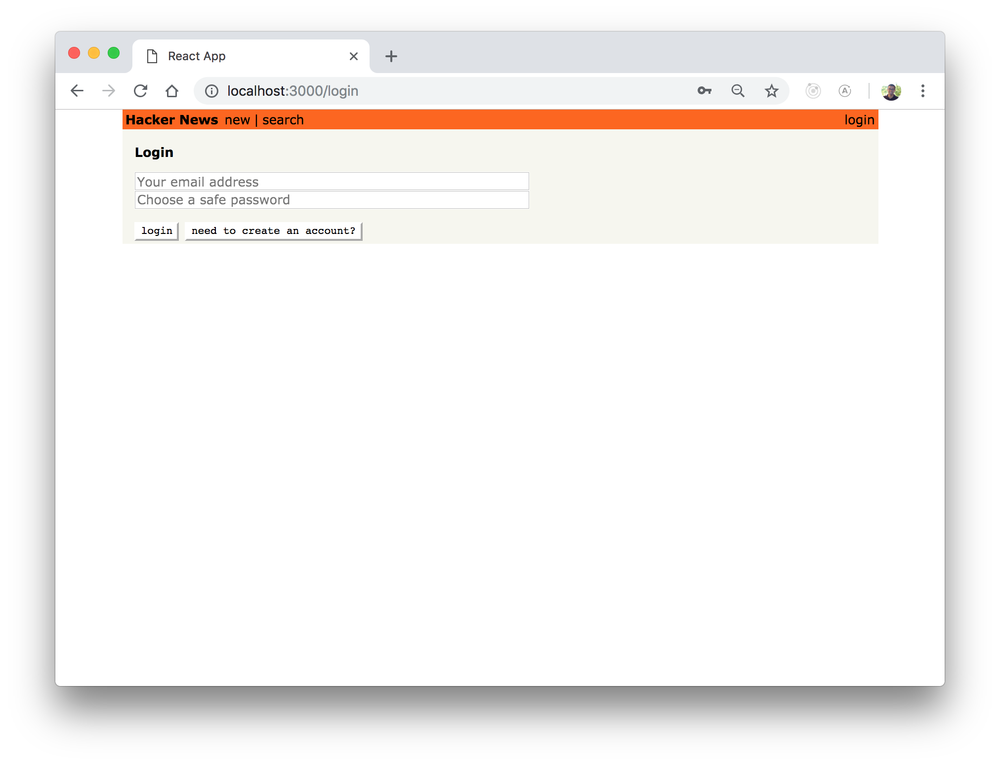
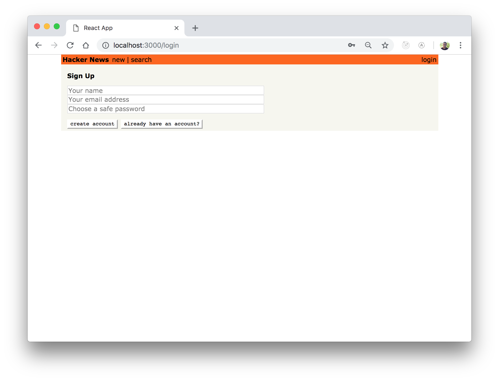
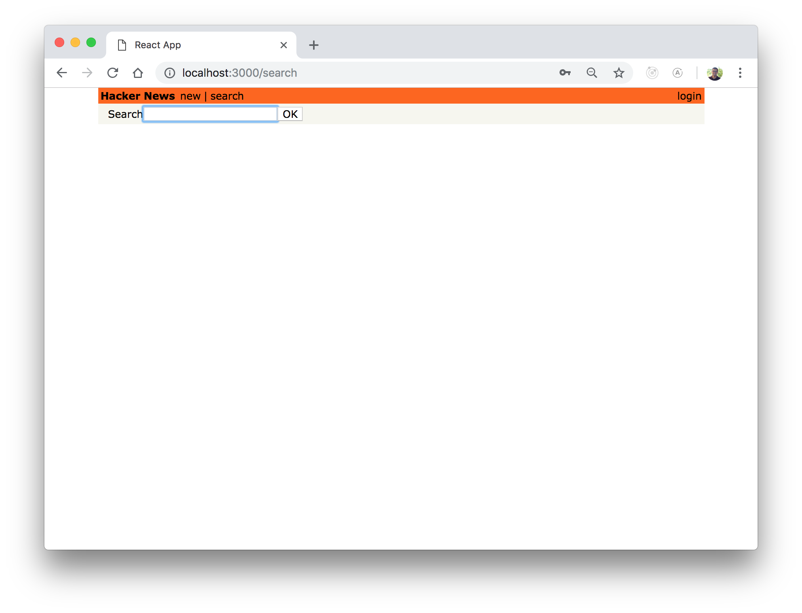

# hackernews-clone

A Hackernews Clone built with GraphQL, React, Apollo, and Prisma.

## Usage

Start the server

```
node server/src/index.js
```

In another terminal, start the react app

```
npm run start
```

### Feed


### login

### Sign Up

### Search 
Powered by Apollo Client 

